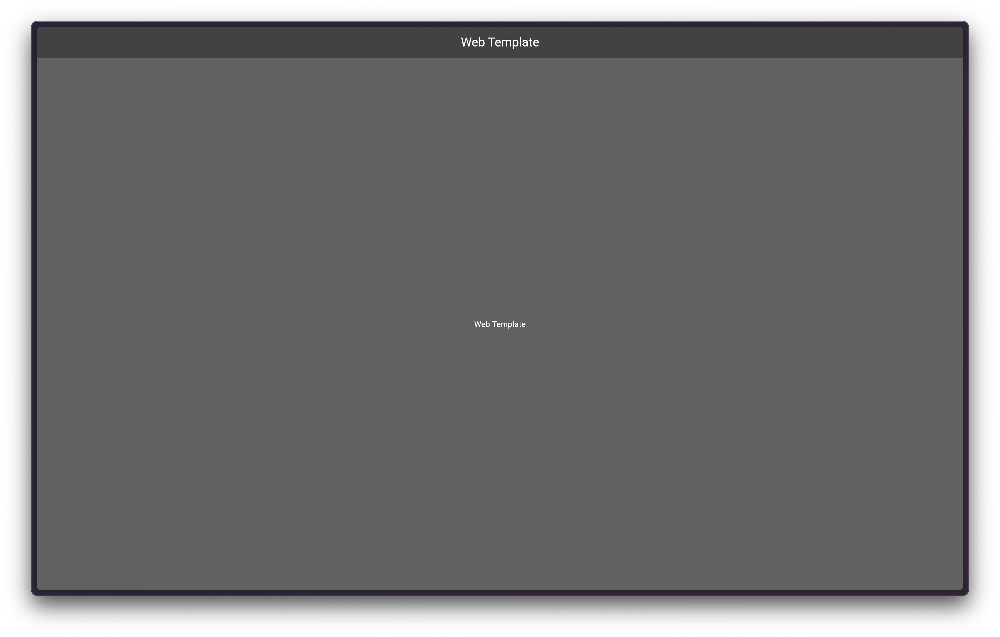

# web_template

Custom template for creating a standalone PWA using Flutter.

# What has already been created:

- [Localizations](lib/src/common/localizations/intl_en.arb)
- [Themes](lib/src/common/theme/theme_resolver.dart)
- [Configs](config/config_development.json) and [environment store](lib/src/common/environment/environment_store.dart)
- [Application Metadata](lib/src/common/app_metadata/app_metadata.dart)
- [Dependency initialization and application entry point](lib/src/common/application/application.dart)
- [Navigation](lib/src/common/navigation/routes.dart) ([Octopus](https://pub.dev/packages/octopus))
- [Logger](lib/src/common/logger/logger.dart) & [Tracking Manager](lib/src/common/logger/logger_tracking_manager.dart) ([Logging](https://pub.dev/packages/logging))

# How to use it

1. Use the "Use this template" button or copy the repository to yourself.
2. Clone the repository.
3. Use the toolset command to rename the project:

> `dart run tools/rename_project.dart --name="yourname" --description="yourdescription"`

4. Enjoy!

# Contributions

Contributions to this project are welcome. If you have any feedback, suggestions, or improvements, feel free to open an issue or submit a pull request.

# Maintainers

[Igor Molchanov](https://github.com/meg4cyberc4t)

This library is open for issues and pull requests. If you have ideas for improvements or bugs, the repository is open to contributions!

# License

This project is licensed under the GNU GPL-3.0 - see the LICENSE.md file for details.
